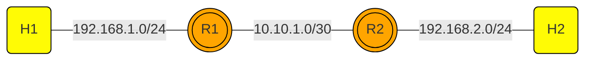

# static-routing-mininet
`static-routing-mininet` is a repository designed to help users learn about networking, focusing on traditional static routing and programmable networks using the Mininet environment. This repository includes scripts and configurations for setting up static routing between two routers (R1 and R2), demonstrating fundamental IP forwarding and routing principles.

## Features
- **Static Routing Setup**: Easy-to-follow scripts that establish static routing between routers.
- **Networking Basics**: Learn core networking concepts, including IP forwarding, subnetting, and routing tables.
- **Programmable Networks**: Utilize the capabilities of Mininet to simulate real-world networking scenarios in a virtual environment.

## Usage
To run the static routing simulation, execute the following command in your terminal:
```bash
sudo python3 static_routing_2rtr.py
```
This command will start the Mininet environment and set up the static routing between the two routers as defined in the script.

## Static Routing
This project demonstrates static routing between hosts and routers, visualized using the following network topology:

### Static Routing Topology



## Topology

This topology consists of:
- 2 routers (R1 and R2)
- 2 hosts (H1 and H2)

## Configuration

### IP Configuration:
**Interface and IP**
- R1: 
  - `r1-eth0: 192.168.1.1/24`
  - `r1-eth1: 10.10.1.1/30`
- R2: 
  - `r2-eth0: 192.168.2.1/24`
  - `r2-eth1: 10.10.1.2/30`

**IP and Default Gateway**
- H1: 
  - `192.168.1.2/24 : 192.168.1.1`
- H2: 
  - `192.168.2.2/24 : 192.168.2.1`

## Script Explanation
### 1. LinuxRouter Class Definition

```python
class LinuxRouter(Node):
    def config(self, **params):
        super(LinuxRouter, self).config(**params)
        self.cmd('sysctl -w net.ipv4.ip_forward=1')
        self.cmd('sysctl -w net.ipv6.conf.all.forwarding=1')
        # Start FRRouting services (FRR)
        self.cmd('/usr/lib/frr/zebra -A 127.0.0.1 -s 90000000 -f /etc/frr/frr.conf -d')
        self.cmd('/usr/lib/frr/staticd -A 127.0.0.1 -f /etc/frr/frr.conf -d')
        self.cmd('/usr/lib/frr/ospfd -A 127.0.0.1 -f /etc/frr/frr.conf -d')
        self.cmd('/usr/lib/frr/ospf6d -A ::1 -f /etc/frr/frr.conf -d')
        self.cmd('/usr/lib/frr/bgpd -A 127.0.0.1 -f /etc/frr/frr.conf -d')
        self.cmd('/usr/lib/frr/pimd -A 127.0.0.1 -f /etc/frr/frr.conf -d')
        self.cmd('/usr/lib/frr/pim6d -A ::1 -f /etc/frr/frr.conf -d')
        self.cmd('/usr/lib/frr/isisd -A 127.0.0.1 -f /etc/frr/frr.conf -d')

    def terminate(self):
        self.cmd('killall zebra staticd ospfd ospf6d bgpd pathd pimd pim6d ldpd isisd nhrpd vrrpd fabricd')
        super(LinuxRouter, self).terminate()
```

**Explanation:**
- **LinuxRouter class** is a subclass of Node that is customized to function as a Linux router.
- **config method**:
  - Enables IP forwarding for IPv4 and IPv6, allowing the router to forward packets between network interfaces.
  - Runs various FRRouting (FRR) daemons such as zebra, staticd, ospfd, bgpd, etc., providing dynamic routing and routing management.
- **terminate method**:
  - Stops all FRR daemon processes when the router shuts down.

---

### 2. `run()` Function

```python
def run():
    privateDirs = [('/var/log'), 
                   ('/etc/frr', '/home/ubuntu/net101/frr-config/%(name)s'), 
                   ('/var/run'), 
                   '/var/mn']
    net = Mininet(topo=None, autoSetMacs=True)
```

**Explanation:**
- **privateDirs**: Defines private directories used by each node, ensuring router-specific configuration and logs are isolated.
- **Mininet()**: Creates a Mininet network instance without a predefined topology and automatically sets MAC addresses.

---

### 3. Adding Routers

```python
info('*** Add Routers\n')
r1 = net.addHost('r1', cls=LinuxRouter, ip='192.168.1.1/24', privateDirs=privateDirs)
r2 = net.addHost('r2', cls=LinuxRouter, ip='192.168.2.1/24', privateDirs=privateDirs)
```

**Explanation:**
- Adds two routers (`r1` and `r2`) to the network using the `LinuxRouter` class.
- Sets the initial IP addresses for each router.
- Configures private directories for each router's unique configuration.

---

### 4. Adding Hosts

```python
info('*** Add hosts\n')
h1 = net.addHost('h1', cls=Node, ip='192.168.1.2/24', defaultRoute='via 192.168.1.1')
h2 = net.addHost('h2', cls=Node, ip='192.168.2.2/24', defaultRoute='via 192.168.2.1')
```

**Explanation:**
- Adds two hosts (`h1` and `h2`) to the network.
- Sets the IP address and default gateway for each host, allowing them to route packets to networks not directly connected.

---

### 5. Adding Links

```python
info('*** Add links\n')
# Host to Router links
net.addLink(h1, r1)
net.addLink(h2, r2)
# Router to Router links
net.addLink(r1, r2, intfName1='r1-eth1', intfName2='r2-eth1', params1={'ip': '10.10.1.1/30'}, params2={'ip': '10.10.1.2/30'})
```

**Explanation:**
- **Host to Router links**:
  - Connects `h1` to `r1` and `h2` to `r2`.
- **Router to Router links**:
  - Connects `r1` and `r2` using specific interfaces (`r1-eth1` and `r2-eth1`).
  - Sets IP addresses for these interfaces, creating a point-to-point connection between the routers.

---

### 6. Starting the Network

```python
info('*** Starting network\n')
net.start()
```

**Explanation:**
- Starts the Mininet network with all nodes and links configured.

---

### 7. Adding Static Routes

```python
info('*** Adding static routes\n')
# Add static routes to r1 and r2
r1.cmd('ip route add 192.168.2.0/24 via 10.10.1.2')
r1.cmd('ip route add 10.10.3.0/30 via 10.10.2.2')
r2.cmd('ip route add 192.168.1.0/24 via 10.10.1.1')
r2.cmd('ip route add 10.10.2.0/30 via 10.10.3.1')
```

**Explanation:**
- Adds static routes on `r1` and `r2` to forward packets to networks that are not directly connected.

---

### 8. Running the CLI and Stopping the Network

```python
CLI(net)
net.stop()
```

**Explanation:**
- **CLI(net)**: Starts the Mininet command line interface, allowing interaction with the network (e.g., running commands on hosts or routers).
- **net.stop()**: Stops the Mininet network and cleans up the configuration.

---

# Step-by-Step Guide
## Step 1: Run the Static Routing Script

Navigate to the `static-routing-mininet` directory and run the Python script:
```bash
cd static-routing-mininet
sudo python3 static_routing_2rtr.py
```

This script will:

1. Add two routers (`r1` and `r2`)
2. Add two hosts (`h1` and `h2`)
3. Establish links between them
4. Configure static routes between the routers
5. Start the Mininet CLI

### Step 2: Test Connectivity

Once the script is executed, Mininet CLI will start. You can test the connectivity between `h1` and `h2` using the `ping` command:

```bash
mininet> h1 ping h2
```

You should see a successful ping response similar to this:

```
PING 192.168.2.2 (192.168.2.2) 56(84) bytes of data.
64 bytes from 192.168.2.2: icmp_seq=1 ttl=62 time=0.111 ms
64 bytes from 192.168.2.2: icmp_seq=2 ttl=62 time=0.036 ms
```

### Step 3: Test Connectivity
After the script has been successfully executed, you can verify the connection between the hosts `h1` and `h2` using the `ping` command:

```bash
mininet> h1 ping h2
```

If your configuration is correct, you will see a result like the one below, indicating that `h1` can communicate with `h2`:

```
PING 192.168.2.2 (192.168.2.2) 56(84) bytes of data.
64 bytes from 192.168.2.2: icmp_seq=1 ttl=62 time=0.111 ms
64 bytes from 192.168.2.2: icmp_seq=2 ttl=62 time=0.036 ms
```

### Step 4: Verify Network Path with Traceroute

To view the path taken by data packets from `h1` to `h2`, you can use the `traceroute` command. This will provide an overview of the routers the data packets pass through on their way to the destination host.

Run the following command in the Mininet CLI:

```bash
mininet> h1 traceroute h2
```

The traceroute results will show how the data packets traverse the network. Below is an example of the result you might see:

```
traceroute to 192.168.2.2 (192.168.2.2), 30 hops max, 60 byte packets
 1  192.168.1.1 (192.168.1.1)  0.145 ms  0.115 ms  0.111 ms
 2  10.10.1.2 (10.10.1.2)  0.107 ms  0.096 ms  0.090 ms
 3  192.168.2.2 (192.168.2.2)  0.085 ms  0.076 ms  0.069 ms
```

#### Traceroute Results Explanation:

- **Hop 1: 192.168.1.1**  
  The packet first passes through router `r1`, which has the IP `192.168.1.1`. This is the first router connecting host `h1` to the network.

- **Hop 2: 10.10.1.2**  
  The packet is then forwarded to the second router (`r2`) with the IP `10.10.1.2`. This indicates the packet's movement from `r1` to `r2`.

- **Hop 3: 192.168.2.2**  
  Finally, the packet reaches the destination host `h2` with the IP `192.168.2.2`.

Each hop shows the round-trip time (RTT) in milliseconds, indicating that your network is functioning properly and the data packets are reaching their destination without issues.

--- 

# Licencse
This project is licensed under the Creative Commons Legal Code CC0 1.0 Universal. See the [LICENSE](LICENSE) file for details.

# Testing and Results
### Testing Steps:
1. Ping from `H1` to `H2`.


2. Traceroute from `H1` to `H2`.


## Conclusion
This script creates a basic network topology using Mininet, consisting of two routers (`r1` and `r2`) with enhanced routing capabilities provided by FRRouting (FRR), and two hosts (`h1` and `h2`) connected to each router. Links between hosts and routers, as well as a point-to-point link between the routers, are established. Additionally, static routing is implemented to facilitate communication between hosts located in different networks.
